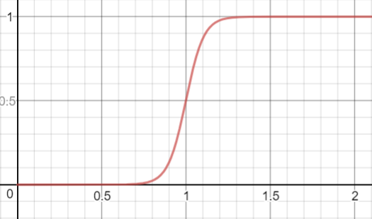

## Logistic Regression(로지스틱 회귀)

---

<h2>목차</h2>

---

1. [개념](#intro)
2. [선형 회귀분석](#linear)
3. [로지스틱 회귀분석](#logistic)
4. [문제 해결 방법2](#resolve2)
5. [주의점](#warning)

<h2>개념
<a href="#index">목차</a>
</h2>

---

분류 문제 중 분류가 예, 아니오 처럼 **2가지로만** 나누어진 경우 **이항형**에 사용하는 알고리즘 입니다.

>분류문제란 새로운 데이터가 어느 그룹 속하는지를 구분하는 문제입니다.
>
>그 중 이항형 문제는 Logistic Regression으로,
>
>다항형 문제는 Multinomual Logistic Regression, 혹은 Ploytomous Logistic Regression을 이용하고,
>
>다항형 문제 중 순서가 존재하는 경우에는 Orrdinal Logistic Regression을 이용합니다.
>
>오늘은 이항형의 경우만 다루겠습니다.

그럼 그에 앞서 **선형 회귀분석**에 대해 설명하겠습니다.

<h2>선형 회귀분석
<a href="#index">목차</a>
</h2>

---

### 선형 회귀분석

---

y= ax + b (x,y : -Inf<=x,y<=Inf(즉, 무한대)) 형태의 **1차 함수**를 분석하는 것입니다.

>분석을 위해 이 **a와 b**를 찾아내야 하는데,
>
>그를 위한 방법으로는 **최소제곱법**이 사용됩니다.

다시말해 x의 변화에 따라 y가 어떻게 변하는지, 혹은 y의 변화에 따라 x가 어떻게 변하는지,

즉 x와 y가 어떤 관계를 가지는지 예측하는 것입니다.

<h2>로지스틱 회귀분석
<a href="#index">목차</a>
</h2>

---

선형 회귀분석의 개념에서 착안하여 **y = A일 확률**이라고 정의하고 **y >= a**이면 A, **y < a**이면 not A(=B)라고 분류하는 것입니다.
>
>**a**를 적절히 정하는 것이 매우 중요합니다.

그래서 먼저 **y의 범위**를 수정해줘야 합니다.

기존의 범위에서는 -Inf to Inf지만 확률은 **0 to 1**를 가져야하기 때문입니다.

관계식은 **P = e^(ax + b) / 1 + e^(ax + b)**입니다.

>y = ax + b
>**y를 P로 수정**
>P = ax + b
>>P:0<=P<=1이므로 성립하지 않음
>
>**P를 Odds로 수정**
>Odds = P / (1-P) = ax + b
>>Odds:0<=Odds<=Inf이므로 성립하지 않음
>
>**Odds에 log_e를 씌움**
>log_e(Odds) = log_e(P / 1-P) = ax + b
>>log_e(Odds):-Inf<=log_e(Odds)<=Inf이므로 성립함
>
>**e를 씌움**
>e^{log_e(P / {1-P})} = e^(ax + b)
>
>**역수를 취함**
>1-P / P = 1 / e^(ax + b)
>
>**+1을 함**
>1 / P = {1 / e^(ax + b)} +1 = {1 + e^(ax + b)} / e^(ax + b)
>**역수를 취함**
>P = e^(ax + b) / 1 + e^(ax + b)
