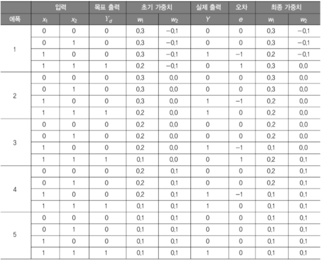

## Artifical Neural Network

---

기계학습

	컴퓨터가 경험, 예, 유추 등을 통해 학습하도록 하는 적응 매커니즘
    학습능력은 시간이 흐르면서 지능형 시스템의 성능을 개선
    적응형 시스템의 기초를 형성
    
    접근법
    	인공신경망
    	유전알고리즘

인공신경망

	뇌를 기반으로 한 추론모델
    	비선형적, 병렬적인 정보처리
        신경망 전체에 동시저장 및 동시처리
        정답의 뉴런은 강화 / 오답의 뉴런은 약화
    적응성을 이용해 학습능력을 구현
    
    모델링
    	복잡한 프로세스(뉴런)들의 링크들로 이루어짐
        각각의 프로세스들의 가중치는 학습에 의해 결정
        

학습
	
    활성화함수
    	입력신호의 가중치합과 임계값을 비교하여 값 출력
        HardLimit(Step, Sign)(-1~1) => 분류, 패턴인식
        Sigmoid(0~1) => 역전파 신경망
        Linear(-inf~inf) => 선형근사
        
    퍼셉트론
    	단일 뉴런의 학습
    	HardLimit 방식
        입력의 개수에 따라 차원 결정
        가중치를 조절하여 실제출력과 목표출력간 차이 최소화
        	e(p):오차 / y(p):출력 / x(p):입력 / w(p):가중치
        	e(p)>0 => y(p)++
    		e(p)<0 => y(p)--
    		x(p)>0 => y(p)++, w(p)++
            x(p)<0 => y(p)--, w(p)--
            
        논리연산자
            And-Or
            
            	전형적인 형태
                목표출력과정을 반복

            Excluusive-Or
                선행분리가 불가능하기에 단층은 학습할수없음
            
    	
    문제점
    	
    	(0,1) (1,0)처럼 Exclusive-Or은 한선으로 나눌수없으므로 적용 불가
        
    해결책
    	BackPropagation Algorithm과 같은 다층신경망 구현
    
    
    
    