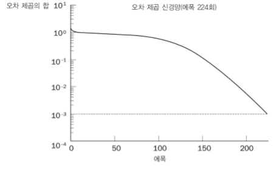

## Artifical Neural Network_2

---

다층 신경망

	입력 - 은닉 - 출력 3가지 계층으로 나누어진 형태
    
    
    입력
    	외부입력을 받음
        특별한 수식은 없음
    
    은닉
    	입력층의 가중치를 설정함
        다수의 은닉층이 존재할 수 있음
    
    출력
    	은닉층의 출력을 통해 전체 출력패턴을 설정
    

역전파(BackPropagation) 신경망
	
    학습패턴을 입력층에 재전송
    목표출력에 도달할때까지 반복
    
    초기화 - 활성화 - 학습 - 반복(to 활성화)
	
    오차제곱의 합
    	신경망의 성능을 보여주는 지표
        1 Epoch동안의 오차제곱의 합이 충분히 작다면 신경망이 수렴했다고 결론
		
        
    Exclusive-Or 문제 해결가능
		
        
    문제점
    	생물학적인 관점에서 뇌의 학습방법이라고 볼수없음
        학습이 느림
        
가속학습

	역전파의 효율을 높이는 방법
    Sigmoid가 쌍곡 탄젠트로 표현될때 더 효율적인 학습 가능
    운동량 상수를 추가함으로써 구현
    
    
    
    Epoch의 숫자가 반으로 급감함
    
    매개변수 조절
    	학습중 매개변수(가중치가 변하는 크기)를 적당히 조절
        	너무 커도, 작아도 문제
        	오차제곱합의 변화량이 계속 같은 부호 => 매개변수 증가
            오차제곱합의 변화량이 계속 다른 부호 => 매개변수 감소
            
            