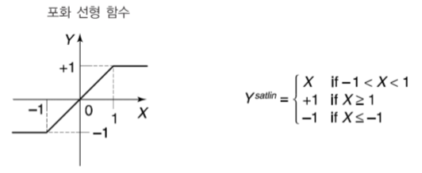
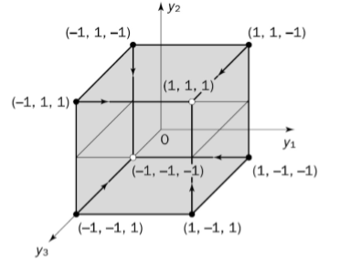

## Artifical Neural Network_3

---

순환 신경망

	학습
    	새로운 입력 적용 => 출력계산 => 입력값 조정 => 출력계산
        출력이 상수값이 될때까지 반복
        
        
    부호활성화를 적용하여 안정성 확보
    	가중입력 <0 => -1
        가중입력==0 => 유지(-1,1)
        가중입력 >0 =>  1
        
        
    
    
    

            
	
    
    
홉필드 신경망

	뉴런이 N개인 신경망에는 가능한 2^N가지 상태가 존재
    이는 곧 N차원의 하이퍼큐브와 같음
    
    
    
    오차 수정 신경망으로 작동
    
    저장 - 검사 - 복구 단계로 구성
        저장
            가중치 행렬은 대각선을 기준으로 대칭(W_ij == W_ji)
            주 대각선은 모두 영행렬
            저장단계에서 정해진 가중치는 바뀌지 않음

        검사
            저장된 정보를 통해 실제 출력을 확인
            모든 정보를 완전히 복구할때 까지

        복구
            오차가 있는 정보를 검사
        
        
    한계
    	오차가 있는 정보는 복구할 수 있지만 다른 정보를 생성하진 못함
        
    극복
    	다른 출력패턴을 만들수있는 순환 신경망을 활용