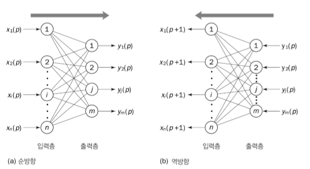
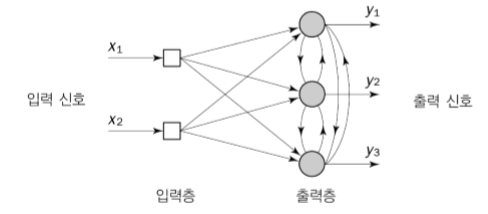

## Artifical Neural Network_4

---

양방향 연상 메모리
	
    홉필드 신경망의 단점 보완
    A클래스 패턴으로 B클래스의 패턴을 연상 가능
	
    
	
    완전하게 연결된 입력-출력층으로 이루어짐
    
    그림의 과정을 출력벡터가 변하지 않을때까지 반복함
    
    저장 - 검사 - 복구 단계를 거침
    	저장
        	패턴쌍 M개를 생성
            
        검사
        	A클래스에서 패턴쌍을 만들었다면 B클래스에서 관련 벡터를 불러올 수 있어야함
    	
        복구
        	오차가 있는 정보를 검사함
            Exclusive-Or 이용
            
        감독, 무감독 학습 모두 가능
    
    
자기조직 신경망(헤브 학습)
	
    양쪽 뉴런이 동시에 활성화 => 가중치 증가
    양쪽 뉴런이 각자 활성화 => 가중치 감소
    
    초기화 - 활성화 - 학습 - 반복
    	초기화
        	가중치, 임계값은 0~1 사이의 임의값 / 학습률, 망각요소는 작은 양의값으로 설정
        
        활성화
        	출력패턴을 계산
        
        학습
        	가중치를 갱신
        
        반복
        	가중치가 안정될때까지 활성화-학습 반복
        
    무감독 학습

경쟁 학습
    
    항상 1개의 뉴런만 활성가능
    뉴런을 활성화하기 위해 뉴런들끼리 경쟁
    코호넨 신경망
    	
        입력-출력 간의 연결뿐만 아니라 출력-출력간의 연결도 존재
        
    초기화 - 활성화/유사도매핑 - 
		초기화
        	가중치를 0~1 사이 임의값 / 학습률 작은 양의값 설정
        
        활성화/유사도매핑
        	코호넨 신경망을 활성화
        	승자독식 뉴런을 찾음
        
        학습
        	가중치를 갱신
        
        반복
        	활성화-학습 과정 반복
        
        
        
        
        